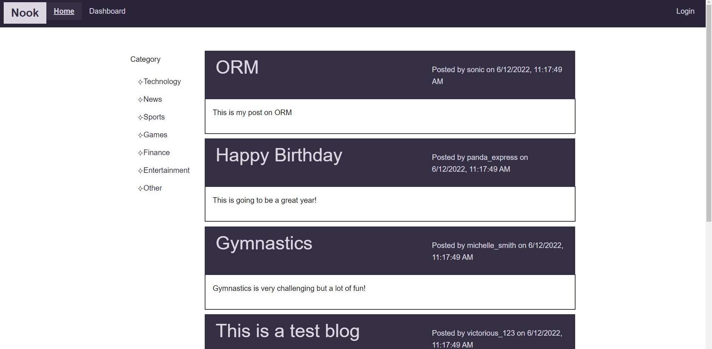

# Brett Shackett's Portfolio

Projects will continuously be added as they are finising up.

## Recently Added
- <a href="https://morning-fortress-48397.herokuapp.com/">Nook</a>

Nook is a blog that allows you to interact with other users, you have the ability to log-in, post, add images, categorize posts and more. This was a successful project and has all the working features to handle users. 

This application was completed by myself and 3 other developers as part of the Columbia University Coding Bootcamp.

## Contact me:
  - [Email](mailto:shackettbrett@gmail.com)
  - <a href="www.linkedin.com/in/brett-shackett">LinkedIn</a> 
